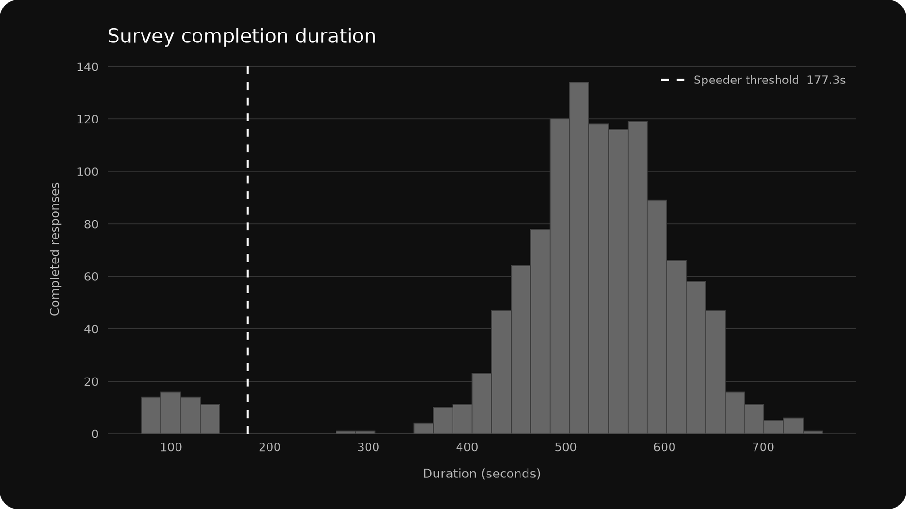
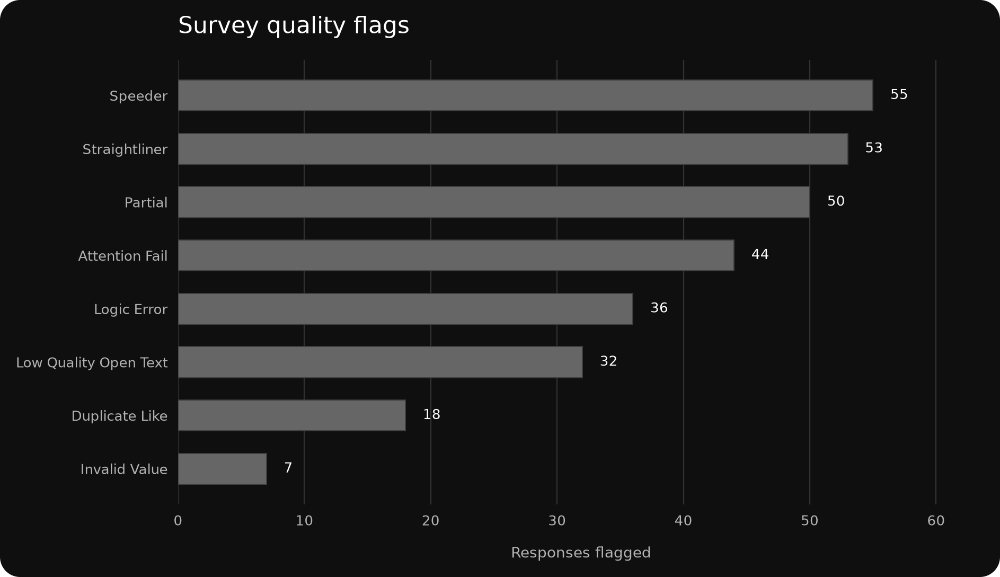

# Survey Response Quality Audit

## Project Snapshot

| Project type | Dataset | Tools | Outputs |
|---|---|---|---|
| Simulated Quantitative Case Study | 1,250 Simulated UK Online Survey Responses | Python / Pandas / NumPy / Matplotlib | Respondent-Level QC Flags; Summary Diagnostics; Figures; Review/Exclusion Recommendations |

**Skills demonstrated:** Survey Data Quality · Data Cleaning & Validation · Paradata Analysis · Survey Logic & Routing Checks · Simulated Fieldwork & Data-Collection QC · Duplicate Detection · Open-Text Quality Review · Reproducible Analysis · Data Visualisation

## Study Context

This simulated case study is set within a hypothetical UK online survey about restaurant-delivery usage and experience. The target population is adults aged 18–74 who ordered restaurant delivery within the previous 3 months, with simulated fieldwork running from 6–20 July 2026.

The dataset contains 1,250 captured responses, including 1,200 completed responses and 50 partial responses. Fictional delivery-service names are used only to make the scenario realistic; the purpose of the case study is to assess survey response quality rather than draw conclusions about the restaurant-delivery market.

## Audit Objective

The objective is to identify responses that may not be sufficiently reliable for analysis using transparent, reproducible rules based on completion status, paradata, response patterns, routing consistency, duplicate-like metadata and open-text quality.

Each respondent receives individual QC flags, followed by a recommendation for manual review or exclusion.

## Quality Checks

The audit applies eight respondent-level quality checks:

1. **Partial responses** — Surveys not marked complete or with progress below 100%.
2. **Speeding** — Completed surveys below one-third of the median completed survey duration.
3. **Straight-lining** — The same response across all eight items in the main 1–7 rating grid.
4. **Attention-check failure** — Respondents who do not select the instructed answer on the embedded attention check.
5. **Invalid values** — Age, NPS, or 1–7 rating variables outside their permitted ranges.
6. **Logical inconsistencies** — Contradictions across eligibility, recency, routing, support-contact, and related survey answers.
7. **Duplicate-like submissions** — Repeated browser fingerprints combined with identical substantive answer patterns.
8. **Low-quality open text** — Blank, nonsensical, extremely short, numeric-only, or repetitive open-ended responses.

The median duration among completed responses was 532.0 seconds. The resulting speeder threshold was 177.3 seconds.

## Findings

272 responses (21.8%) received at least one QC flag. Of these, 177 were recommended for manual review and 95 were recommended for exclusion under the pre-specified decision rules.

| Flagged | Manual Review | Exclusion |
|---:|---:|---:|
| 272 | 177 | 95 |

| QC check | Responses flagged | Share of all responses |
|---|---:|---:|
| Partial | 50 | 4.0% |
| Speeder | 55 | 4.4% |
| Straightliner | 53 | 4.2% |
| Attention Fail | 44 | 3.5% |
| Invalid Value | 7 | 0.6% |
| Logic Error | 36 | 2.9% |
| Duplicate Like | 18 | 1.4% |
| Low Quality Open Text | 32 | 2.6% |

## Decision Logic

A single behavioural warning is not treated as sufficient evidence for automatic exclusion. Partial responses, invalid values, and duplicate-like submissions are treated as hard failures; otherwise, at least two behavioural indicators are required for an exclusion recommendation.

This keeps the decision rule auditable and avoids treating a single suspicious pattern as definitive evidence of poor response quality.

## Figures

### Completion Duration

Completed responses had a median duration of 532.0 seconds. The audit classified completed responses below 177.3 seconds as speeders; the dashed line marks this threshold.

### Quality Flags

Speeding was the most common individual flag (55 responses), followed by straight-lining (53) and partial responses (50). The Findings table above provides the exact count and share for every QC rule.

## Project Files

- [`report.md`](report.md) — This report.
- [`outputs/quality_flags.csv`](outputs/quality_flags.csv) — Respondent-level QC indicators and recommendations.
- [`outputs/quality_summary.csv`](outputs/quality_summary.csv) — Summary counts and thresholds.
- [`figures/completion_duration_distribution.png`](figures/completion_duration_distribution.png) — Completion-time distribution.
- [`figures/quality_flag_counts.png`](figures/quality_flag_counts.png) — Counts for each QC flag.
